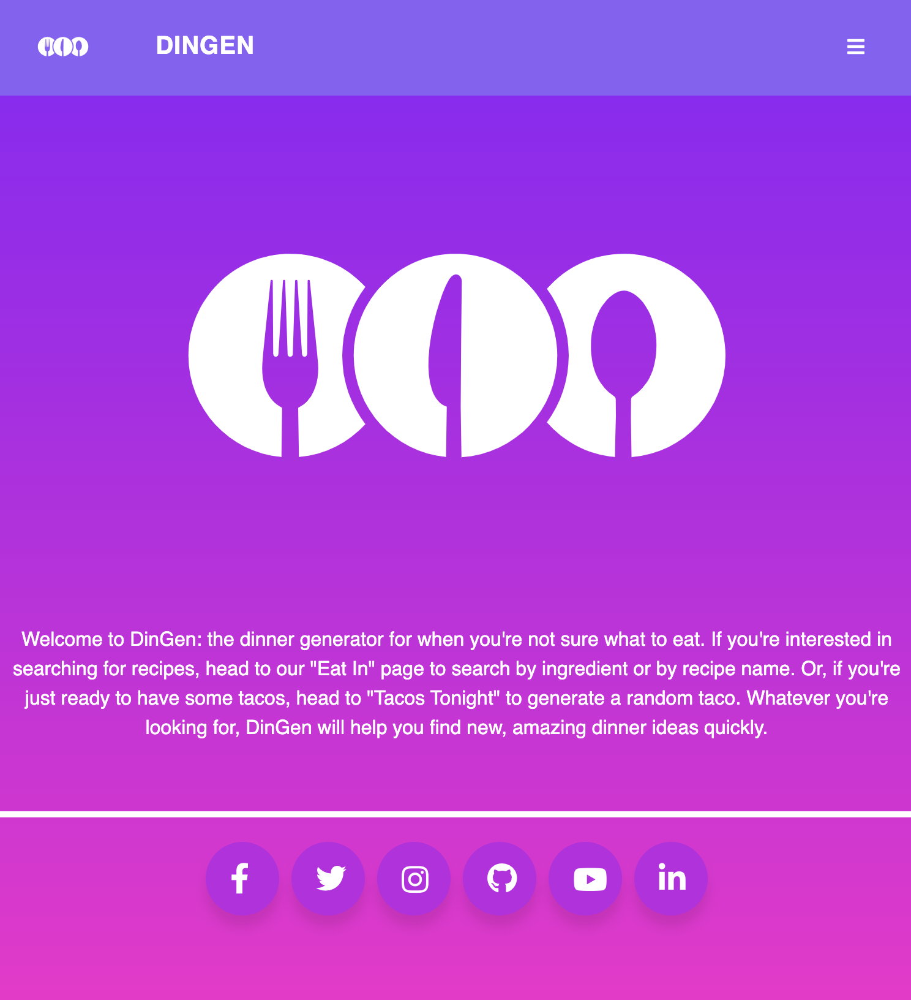
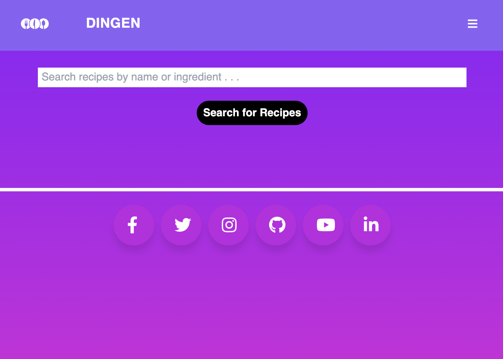
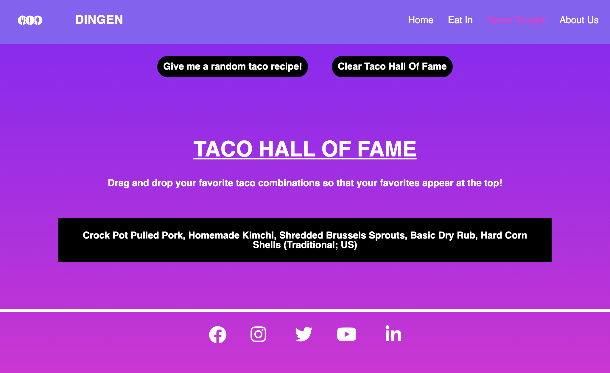

# DinGen: A JavaScript-Based Dinner Generator 

## Description

DinGen is a web application that was built in an agile team environment. It aims to simplify a user's decision-making process when determining what to have for dinner. DinGen's solution is two-fold:

1. For users who want to search by ingredient or by recipe, a recipe generator is included on the "Eat In" page. This recipe generator fetches data from the public MealDB API.

2. For users who want a randomized option, the "Tacos Tonight" page allows the user to push a button to generate a random taco from the public tacofancy API.

This application leverages two third-party APIs to provide a rich user experience: Tailwind CSS and the jQuery UI library.

On the "Eat In" page, the user has the option to search for recipes by name or by ingredient. The results of the search are displayed in a modal. Links to each recipe are provided via the JSON response, and clicking one of these links opens the external recipe in a new tab. If there are no recipes found for a user search, the error message reads: "No recipes found. Please try again."

On the "Tacos Tonight" page, the user has the option to create a random taco by pressings the "Give me a random taco recipe!" button. The results, which are displayed in a modal, include a base layer, a condiment, a mix in, a seasoning, and a type of shell. The user then has the option to save the search. If the user does not want to save the search and selects "no", then the modal is closed. If the user does want to save the search and clicks "yes", then the random taco ingredients are stored in local storage and appear as a list item in the "Taco Hall of Fame". The user can drag and drop these list items to bring their favorite taco combinations to the top of the list. The user also has the option to clear the "Taco Hall of Fame" so that no list items appear on the page.

The application also features an "About Us" page, which includes more information about the developers behind DinGen.

As a team, we faced a few different challenges while building the application. One of these challenges was that the tacofancy API recipes are in markdown format, which made it difficult to display the text in an easy-to-read manner. We solved the issue by including links to the taco ingredient recipes instead, since the external files are much more easy to read.

Another challenge our team faced was making sure that data from the APIs displayed correctly in the modals. This required us to analyze the HTML, CSS, and JavaScript to make sure that everything was properly connected.

Overall, we became much more proficient in using Git and GitHub by building this application. By creating personal branches and making pull requests, we developed skills that we are eager to implement in future projects.

Please find the deployed application here: https://ellisaissa.github.io/super-duper-octo-fiesta/

## Installation

No installation steps are required to view this application. To view the front-end application, visit the URL above. The application's source code can be found on GitHub here: https://github.com/ellisaissa/super-duper-octo-fiesta

## Usage

This web application includes responsive design features and can be viewed on all devices.

Below are screenshots of the deployed application:

## Credits

Jon Yeatman was responsible for designing the basic HTML and CSS layout of the application, and wrote JavaScript for the navigation toggle features.

Valerie Russell built the JavaScript for conditionally fetching data from each API and storing client-side data in local storage. She also modified and refactored the CSS as needed.

Ellisa Issa created the repository and was responsible for writing the code for the modals, and creating social media links for DinGen. Ellisa also assisted with editing the written content of the application.

Kyle Nance designed the About Us page and assisted with the initial search bar functionality for the project.

